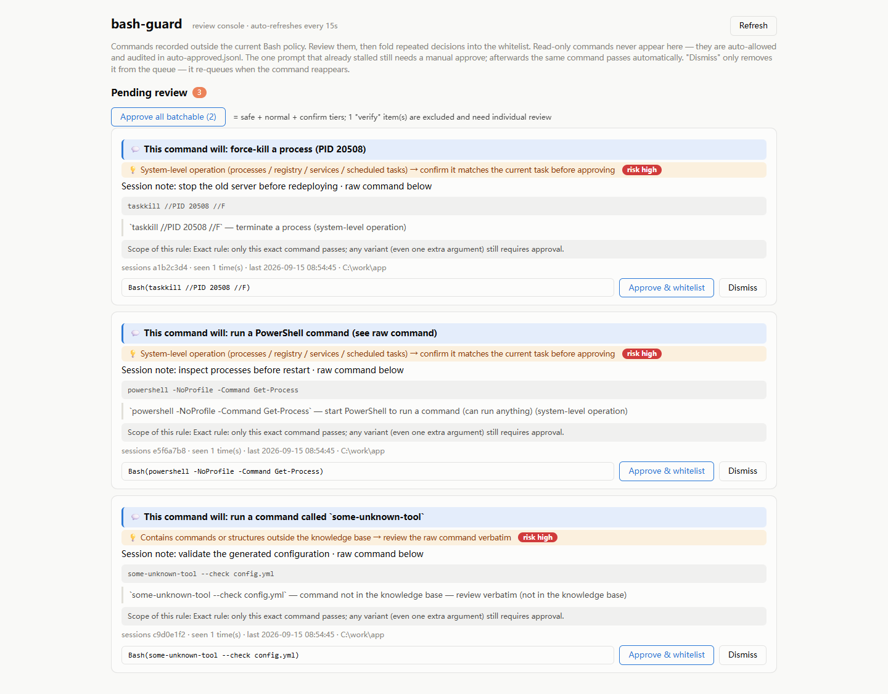

# bash-guard

**Fewer Claude Code permission prompts — without granting `Bash(*)`.**

bash-guard is an explainable Bash permission hook and progressive allowlist
builder for Claude Code. It auto-approves commands covered by your policy,
blocks selected high-risk operations, and records unfamiliar commands in a
local review inbox.

Review what Claude tried, understand what each command does, and turn repeated
decisions into narrow, auditable `Bash(...)` rules.



- **Less approval fatigue** — automatically approve command categories you explicitly trust.
- **Explain before you allow** — see what a command does, its risk level, and the exact scope of the suggested rule.
- **A whitelist that stays understandable** — approvals become narrow Claude Code rules, with a timestamped backup before every settings change.
- **Zero dependencies** — Python 3 standard library only.

> [!IMPORTANT]
> bash-guard reduces permission friction; it is not a security sandbox. Its command classification is approximate, and allowed commands can still have unexpected side effects. Use OS-level isolation for untrusted code.

## The problem

Claude Code asks for permission one command at a time.

Approve too cautiously, and long-running sessions keep stopping. Approve too broadly, and your allowlist becomes a pile of rules you no longer understand — or simply `Bash(*)`.

bash-guard gives you a third option: automate the decisions you already trust, keep an audit trail, and build precise permission rules from real usage.

## How it works

```text
                           Claude Code Bash command
                                      │
                                      ▼
                              PreToolUse hook
                    ┌─────────────────┼─────────────────┐
                    │                 │                 │
          existing allow rule   configured deny   configured auto-allow
                    │                 │                 │
                    ▼                 ▼                 ▼
             pass through       deny + explain     allow + audit

                         anything not classified
                                      │
                                      ▼
                     record in the local review inbox
                                      │
                                      ▼
                 explain → show rule boundary → approve
                                      │
                                      ▼
                        narrow rule in settings.json
```

An unfamiliar command is recorded for later review, but bash-guard does **not** suppress Claude Code's current native permission prompt. Approving the suggested rule prevents the same command from prompting in future sessions. Dismissing an item only removes it from the inbox; it will be recorded again if it reappears.

## Quick start

Requirements: Claude Code and Python 3.10 or newer.

```bash
git clone https://github.com/zonion088-design/bash-guard.git
cd bash-guard

# Register the PreToolUse hook. This is idempotent and backs up settings.json.
python install_hook.py

# Start the local review console.
python console.py
# Open http://127.0.0.1:8642
```

The console binds to `127.0.0.1` only.

## Default policy

Every segment of a compound command must pass. Wrapper commands such as `env`, `timeout`, `xargs`, and `sudo` are unwrapped before classification.

| Category | Examples | Default decision |
|---|---|---|
| READ | `ls`, `cat`, `git log`, `grep` | Auto-allow and audit |
| WRITE | `cp`, `mkdir`, `sed -i`, output redirects | Auto-allow and audit |
| EXEC | `python app.py`, `node server.js` | Auto-allow and audit |
| NET | localhost requests, `git pull` | Auto-allow and audit |
| PKG | `pip install`, `npm install` | Auto-allow and audit |
| SYS | `powershell`, `kill`, `reg`, `schtasks`, `docker run` | Record for review; native prompt remains |
| UNK | Commands outside the knowledge base | Record for review; native prompt remains |
| DEL | Commands classified as deletion | Deny and explain |
| NET_OUT | Commands classified as outbound transfer | Deny and explain |

The defaults prioritize productive local agent workflows, not hostile-code containment. In particular, running code and installing packages are powerful operations. Review the defaults before using bash-guard in a sensitive environment.

## The review inbox

Each recorded command includes:

- a plain-language summary and risk tier;
- a segment-by-segment explanation;
- structural notes for redirects and command substitution;
- the sessions, working directory, and number of occurrences;
- a suggested exact or prefix rule;
- the exact boundary of what that rule will allow.

Approvals are written directly to `~/.claude/settings.json`. bash-guard creates a timestamped backup before changing the file. The generated rules use Claude Code's existing `Bash(command)` and `Bash(prefix:*)` syntax — there is no second policy language to maintain.

## Why not another auto-approve hook?

Most permission hooks answer one question: **Can this command run now?**

bash-guard also helps with the next question: **What should my permission policy remember for the future?** Commands outside the current policy are recorded with an explanation and a suggested Claude Code rule. Before adding it, you can see whether the rule matches one exact command or a broader prefix.

The result is progressive allowlisting: fewer repeated prompts without losing track of why each rule exists or how broadly it matches.

## Configuration

bash-guard works without a configuration file. To customize it:

- **`policy.json`** — optional file next to `guard.py`; override `deny_categories`, `auto_allow_categories`, or the denial note shown to the model.
- **`BASH_GUARD_PORT`** — review-console port; defaults to `8642`.
- **`BASH_GUARD_HOME`** and **`BASH_GUARD_STATE_DIR`** — override the home and state directories, useful for multiple profiles and tests.

Example `policy.json`:

```json
{
  "deny_categories": ["DEL", "NET_OUT"],
  "auto_allow_categories": ["READ"]
}
```

Starting with READ-only auto-approval is a good conservative baseline.

## Security model and limitations

- Classification is dictionary- and pattern-based, not a complete shell AST or an execution sandbox. Treat decisions as convenience policy, not a security boundary.
- The matcher approximates Claude Code's `Bash`, `Bash(command)`, and `Bash(prefix:*)` semantics. It does not model `deny`/`ask` overrides or every shell-wrapper edge case.
- Code execution and package installation may execute arbitrary third-party code even when classified as EXEC or PKG.
- A command recorded in the inbox still falls back to Claude Code's native permission flow for that invocation.
- An approved rule takes effect for new agent sessions. A prompt already on screen still needs a manual decision.
- Hook errors fail open to Claude Code's normal permission flow so a broken logging path does not break the CLI.
- On Windows, hook paths must use forward slashes. `install_hook.py` handles this automatically.

If you need strong isolation, run the agent in a disposable VM, container, or OS sandbox and use bash-guard only as the permission UX layer.

## Development

The test suite uses plain Python assertions and redirects `HOME` and state files to temporary directories. It never touches your real Claude Code settings.

```bash
python tests/test_null_redirect.py
python tests/test_explain.py
python tests/test_plain.py
python tests/test_auto_allow.py
python tests/test_hook.py
python tests/test_policy.py
python tests/test_e2e.py
```

CI runs on Ubuntu and Windows with Python 3.10 and 3.12.

## Roadmap

- [ ] Adapters for additional agent CLIs
- [ ] Broader command and subcommand coverage
- [ ] Internationalized explanations

## License

[MIT](LICENSE)
